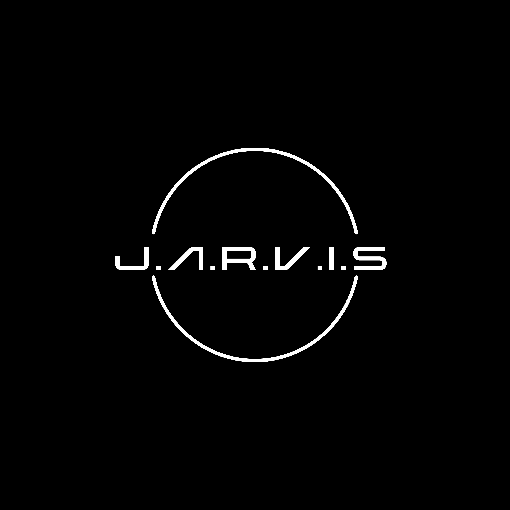
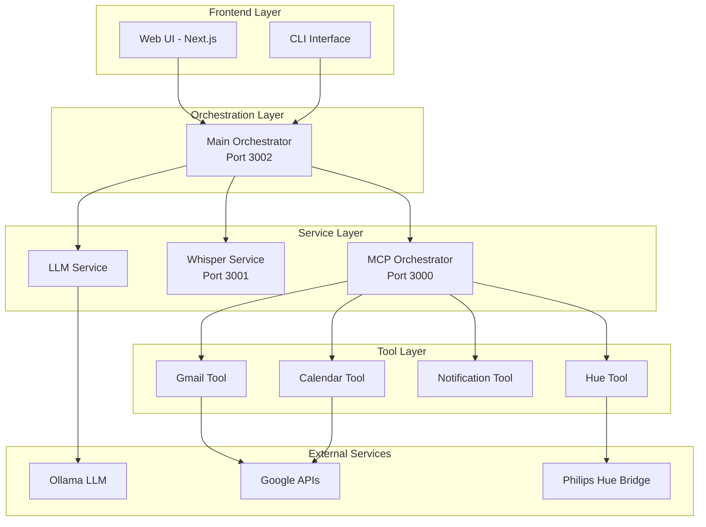

<div align="center">



# Jarvis - AI Assistant

**A modern AI assistant built with clean, service-oriented architecture**

[](https://github.com/armandblin/light-jarvis)
[](https://www.python.org/downloads/)
[](LICENSE)
[](https://github.com/psf/black)
[](https://github.com/astral-sh/ruff)
[](https://www.typescriptlang.org/)
[](https://nextjs.org/)
[](https://reactjs.org/)
[](https://tailwindcss.com/)

[](#)
[](#)
[](#)
[](#)

</div>

---

## ✨ Features

### 🎤 **Speech Recognition & Synthesis**
- **Whisper.cpp Integration**: High-quality speech-to-text using local Whisper models
- **Edge-TTS Support**: Natural text-to-speech with multiple voice options
- **Real-time Processing**: Low-latency audio processing and conversion
- **Multi-language Support**: Configurable language settings

### 🤖 **AI-Powered Intelligence**
- **Local LLM Integration**: Powered by Ollama with support for various models
- **Streaming Responses**: Real-time chat with streaming capabilities
- **Context Awareness**: Maintains conversation context across interactions
- **Tool Integration**: Seamless integration with external services and APIs

### 🛠️ **Comprehensive Tool Suite**
- **📧 Gmail Integration**: Read, search, and send emails
- **📅 Calendar Management**: Create, list, and manage calendar events
- **🔔 Smart Notifications**: System notifications and scheduled reminders
- **💡 Philips Hue Control**: Smart lighting control and automation
- **🔌 Extensible Architecture**: Easy to add new tools and services

### 🌐 **Modern Web Interface**
- **Next.js Frontend**: Modern React-based web interface
- **Responsive Design**: Mobile-first, responsive UI with Tailwind CSS
- **Real-time Updates**: Live chat interface with streaming responses
- **Dark/Light Mode**: Beautiful UI with theme support
- **TypeScript**: Fully typed frontend for better development experience

### 🏗️ **Clean Architecture**
- **Microservices Design**: Modular, service-oriented architecture
- **API-First**: RESTful APIs with comprehensive documentation
- **Dependency Injection**: Clean separation of concerns
- **Configuration Management**: Flexible configuration with TOML and environment variables
- **Comprehensive Logging**: Structured logging with rotation and rich formatting

---

## 🏗️ Architecture

Jarvis is built with a clean, service-oriented architecture that separates concerns and enables easy maintenance and extension.

### Service Overview



### Core Services

#### 🎯 **Main Orchestrator** (`packages/main-orchestrator/`)
- **Port**: 3002
- **Purpose**: Central coordination hub for all services
- **Features**:
  - LLM integration and conversation management
  - Service coordination and health monitoring
  - Streaming response handling
  - CLI and web interface endpoints

#### 🔧 **MCP Orchestrator** (`packages/mcp-orchestrator/`)
- **Port**: 3000
- **Purpose**: Unified interface for all MCP (Model Context Protocol) tools
- **Features**:
  - Tool discovery and execution
  - Google OAuth authentication management
  - Request routing and response aggregation
  - Tool-specific error handling

#### 🎤 **Whisper Service** (`packages/whisper-service/`)
- **Port**: 3001
- **Purpose**: Dedicated speech processing service
- **Features**:
  - Speech-to-Text using Whisper.cpp
  - Text-to-Speech using Edge-TTS
  - Audio format conversion and processing
  - Voice selection and configuration

#### 🧠 **LLM Service** (`packages/llm-service/`)
- **Purpose**: Language model integration and management
- **Features**:
  - Ollama integration
  - Model configuration and switching
  - Response streaming and formatting
  - Context management

---

## 🚀 Quick Start

### Prerequisites

- **Python 3.11+** with pip or uv
- **Node.js 18+** and npm/yarn (for web UI)
- **Ollama** running locally
- **FFmpeg** installed (for audio processing)
- **Whisper.cpp** compiled and available

### Installation

1. **Clone the repository**:
   ```bash
   git clone https://github.com/armandblin/light-jarvis.git
   cd light-jarvis
   ```

2. **Install Python dependencies**:
   ```bash
   # Using uv (recommended)
   uv sync
   
   # Or using pip
   pip install -e .
   ```

3. **Install frontend dependencies**:
   ```bash
   cd ui/web
   npm install
   cd ../..
   ```

4. **Set up Whisper.cpp**:
   ```bash
   # Follow the whisper.cpp setup instructions
   # Ensure the model is available at models/ggml-base.en.bin
   ```

5. **Configure environment**:
   ```bash
   cp env.example .env
   # Edit .env with your configuration
   ```

### Running the Services

#### Option 1: Start All Services (Recommended)
```bash
python scripts/start_all_services.py
```

#### Option 2: Start Services Individually

1. **Start MCP Orchestrator**:
   ```bash
   python scripts/start_mcp_orchestrator.py
   ```

2. **Start Whisper Service**:
   ```bash
   python scripts/start_whisper_service.py
   ```

3. **Start Main Orchestrator**:
   ```bash
   python scripts/start_main_orchestrator.py
   ```

4. **Start Web UI** (in a separate terminal):
   ```bash
   cd ui/web
   npm run dev
   ```

#### Option 3: Use the CLI
```bash
# Chat with Jarvis
jarvis chat "Hello, what can you help me with?"

# Start the server
jarvis server

# Stream responses
jarvis chat "Check my emails" --stream
```

---

## 🔧 Configuration

Configuration is managed through `config/default.toml` and environment variables:

### Core Configuration
```toml
[ollama]
host = "http://localhost:11434"
model = "llama3.2:3b"
temperature = 0.1

[mcp]
host = "localhost"
port = 3000

[whisper]
model_path = "models/ggml-base.en.bin"
whisper_cpp_path = "whisper.cpp/build/bin/whisper-cli"
language = "en"

[tts]
engine = "edge"
voice = "en-US-ChristopherNeural"
rate = 50
volume = 1
```

### Google Services
```toml
[google]
credentials_file = "~/.jarvis/google_credentials.json"
token_file = "~/.jarvis/google_token.json"
scopes = [
    "https://www.googleapis.com/auth/gmail.readonly",
    "https://www.googleapis.com/auth/calendar.readonly",
    "https://www.googleapis.com/auth/calendar.events",
]
```

### Philips Hue Integration
```toml
[hue]
bridge_ip = "192.168.1.10"
username = "your-hue-username"
auto_discover = true
timeout = 10
```

---

## 📡 API Endpoints

### Main Orchestrator (Port 3002)

| Method | Endpoint | Description |
|--------|----------|-------------|
| `POST` | `/chat` | Send a chat message |
| `POST` | `/chat/stream` | Stream chat responses |
| `POST` | `/stt/transcribe` | Transcribe audio |
| `POST` | `/tts/speak` | Convert text to speech |
| `GET` | `/services/status` | Check all services status |

### MCP Orchestrator (Port 3000)

| Method | Endpoint | Description |
|--------|----------|-------------|
| `GET` | `/tools` | List available tools |
| `POST` | `/tools/execute` | Execute a tool |
| `POST` | `/auth/google` | Authenticate with Google |
| `GET` | `/auth/status` | Check authentication status |

### Whisper Service (Port 3001)

| Method | Endpoint | Description |
|--------|----------|-------------|
| `POST` | `/stt/transcribe` | Transcribe audio file |
| `POST` | `/stt/transcribe-raw` | Transcribe raw audio data |
| `POST` | `/tts/speak` | Convert text to speech |
| `POST` | `/tts/save` | Save speech to file |
| `GET` | `/tts/voices` | List available voices |

---

## 🛠️ Available Tools

Jarvis has access to a comprehensive suite of tools:

### 📧 **Gmail Tools**
- `gmail_read_emails` - Read and search emails
- `gmail_send_email` - Send emails with attachments
- `gmail_list_labels` - List email labels and folders

### 📅 **Calendar Tools**
- `calendar_list_events` - List calendar events
- `calendar_create_event` - Create new events
- `calendar_update_event` - Update existing events
- `calendar_delete_event` - Delete events

### 🔔 **Notification Tools**
- `send_notification` - Send system notifications
- `schedule_reminder` - Schedule reminder notifications
- `cancel_reminder` - Cancel scheduled reminders
- `list_reminders` - List all scheduled reminders

### 💡 **Philips Hue Tools**
- `hue_list_lights` - List all connected lights
- `hue_toggle_light` - Toggle light on/off
- `hue_set_brightness` - Adjust light brightness
- `hue_set_color` - Change light color
- `hue_set_scene` - Activate predefined scenes

---

## 🌐 Web Interface

The modern web interface provides an intuitive way to interact with Jarvis:

### Features
- **Real-time Chat**: Live conversation with streaming responses
- **Voice Input**: Speech-to-text integration
- **Voice Output**: Text-to-speech playback
- **Tool Management**: Visual tool execution and results
- **Settings Panel**: Easy configuration management
- **Responsive Design**: Works on desktop and mobile

### Technologies
- **Next.js 15.5+**: React framework with App Router
- **React 19.1+**: Latest React with concurrent features
- **TypeScript**: Full type safety
- **Tailwind CSS**: Utility-first styling
- **Radix UI**: Accessible component primitives
- **Framer Motion**: Smooth animations
- **Lucide React**: Beautiful icons

---

## 🔍 Development

### Project Structure

```
packages/
├── shared/                 # Shared utilities and models
├── llm-service/           # LLM integration (Ollama)
├── mcp-orchestrator/      # MCP tools consolidation
├── whisper-service/       # STT/TTS functionality
├── main-orchestrator/     # Main coordination service
└── tools/                 # Individual tool implementations
    ├── gmail-tool/
    ├── calendar-tool/
    ├── notification-tool/
    └── hue-tool/

ui/
├── web/                   # Next.js web interface
└── cli/                   # Command-line interface

scripts/                   # Utility scripts
config/                    # Configuration files
docs/                      # Documentation and assets
```

### Adding New Tools

1. Create a new tool package in `packages/tools/`
2. Implement the tool interface following the existing patterns
3. Register the tool in the MCP Orchestrator
4. Update the system prompt in the Main Orchestrator
5. Add frontend integration if needed

### Development Commands

```bash
# Install dependencies
uv sync

# Run tests
pytest

# Run specific test categories
pytest -m unit
pytest -m integration
pytest -m e2e

# Code formatting
black .
ruff check --fix .

# Type checking
mypy packages/

# Security audit
safety check
bandit -r packages/

# Frontend development
cd ui/web
npm run dev
```

### Testing

The project includes comprehensive testing:

- **Unit Tests**: Individual component testing
- **Integration Tests**: Service integration testing
- **End-to-End Tests**: Full workflow testing
- **Coverage**: 80%+ code coverage requirement

---

## 🐛 Troubleshooting

### Common Issues

1. **Whisper.cpp not found**:
   - Ensure whisper.cpp is compiled and in your PATH
   - Check the `whisper_cpp_path` configuration

2. **Model not found**:
   - Download the Whisper model to `models/ggml-base.en.bin`
   - Verify the `model_path` configuration

3. **FFmpeg not found**:
   - Install FFmpeg: `brew install ffmpeg` (macOS)
   - Ensure it's in your PATH

4. **Google authentication fails**:
   - Check your Google credentials file
   - Verify OAuth callback URL configuration

5. **Ollama connection issues**:
   - Ensure Ollama is running: `ollama serve`
   - Check the model is available: `ollama list`

### Logs

Logs are stored in `logs/` directory with daily rotation. Check the latest log files for detailed error information.

```bash
# View latest logs
tail -f logs/$(date +%Y)/$(date +%m)/jarvis.log

# Check service-specific logs
ls logs/$(date +%Y)/$(date +%m)/
```

---

## 📊 Performance

### Benchmarks

- **Speech-to-Text**: ~2-3 seconds for 10-second audio
- **Text-to-Speech**: ~1-2 seconds for 100 words
- **LLM Response**: ~3-5 seconds for complex queries
- **Tool Execution**: ~1-2 seconds for most operations

### Optimization Tips

- Use SSD storage for faster model loading
- Allocate sufficient RAM for Whisper models
- Use GPU acceleration when available
- Configure appropriate timeout values

---

## 🤝 Contributing

We welcome contributions! Please see our [Contributing Guidelines](CONTRIBUTING.md) for details.

### Development Setup

1. Fork the repository
2. Create a feature branch: `git checkout -b feature/amazing-feature`
3. Make your changes
4. Add tests for new functionality
5. Ensure all tests pass: `pytest`
6. Commit your changes: `git commit -m 'Add amazing feature'`
7. Push to the branch: `git push origin feature/amazing-feature`
8. Open a Pull Request

### Code Style

- Follow PEP 8 for Python code
- Use Black for code formatting
- Use Ruff for linting
- Write comprehensive tests
- Document new features

---

## 📄 License

This project is licensed under the MIT License - see the [LICENSE](LICENSE) file for details.

---

## 🙏 Acknowledgments

- [Whisper.cpp](https://github.com/ggerganov/whisper.cpp) for speech-to-text
- [Edge-TTS](https://github.com/rany2/edge-tts) for text-to-speech
- [Ollama](https://ollama.ai/) for local LLM inference
- [FastAPI](https://fastapi.tiangolo.com/) for the web framework
- [Next.js](https://nextjs.org/) for the frontend framework
- [Radix UI](https://www.radix-ui.com/) for accessible components
- [Tailwind CSS](https://tailwindcss.com/) for styling

---

## 📞 Support

- **Documentation**: [Wiki](https://github.com/armandblin/light-jarvis/wiki)
- **Issues**: [GitHub Issues](https://github.com/armandblin/light-jarvis/issues)
- **Discussions**: [GitHub Discussions](https://github.com/armandblin/light-jarvis/discussions)
- **Email**: armand.blin@gmail.com

---

<div align="center">

**Made with ❤️ by [Armand Blin](https://github.com/armandblin)**

[⭐ Star this repo](https://github.com/armandblin/light-jarvis) • [🐛 Report Bug](https://github.com/armandblin/light-jarvis/issues) • [💡 Request Feature](https://github.com/armandblin/light-jarvis/issues)

</div>
